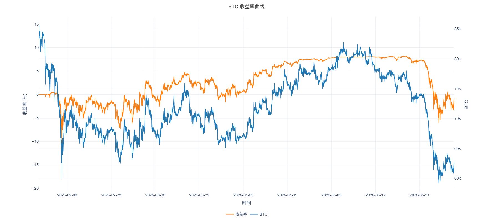
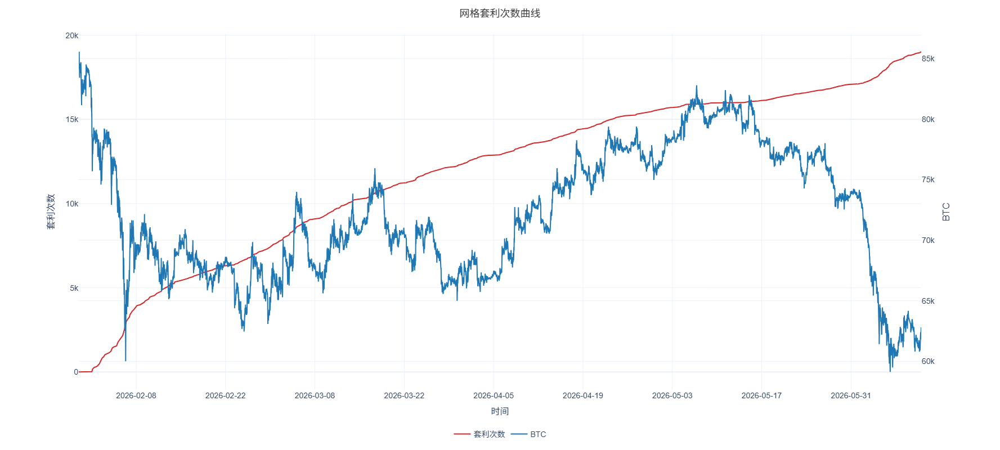

# 合约网格策略回测系统

基于 Python 的合约网格策略历史回测系统，采用Trae、Qoder辅助开发，支持从 **Binance 交易所**获取 USDT 本位永续合约K线数据，进行网格策略回测并生成可视化报告。

## 示例结果图





## 功能特点

- **网格策略回测**：支持等差/等比网格模式，多/空双向交易
- **安全杠杆机制**：自动计算安全杠杆倍数，确保极端行情下强平价在价格区间外
- **K线内分阶段模拟**：阳线/阴线各分 3 个阶段模拟价格运动，精确检测网格触发
- **初始建仓统一价**：所有网格以第一根 K 线收盘价统一市价开仓
- **增量数据更新**：本地 Parquet 缓存（若无会自动获取并保存），仅从 API 获取缺失时间段数据并保存
- **交互式报告**：基于 Plotly 生成 HTML 报告，含收益率曲线、套利次数曲线等
- **GUI 图形界面**：Tkinter 图形界面，支持参数配置、进度显示、停止回测
- **合约规格自动填充**：选择交易品种后自动从 `contract_specs.json` 读取合约规格和最小交易单位
- **合约规格可自定义**：用户可直接编辑 `contract_specs.json` 文件修改任意品种的参数

## 项目结构

```
grid_test/
├── gui.py                    # GUI 入口（Tkinter 图形界面）
├── main.py                   # CLI 命令行入口
├── fetch_specs.py            # 从 OKX API 拉取合约规格
├── contract_specs.json       # 合约规格配置（用户可手动修改）
├── requirements.txt          # Python 依赖
├── modules/
│   ├── grid_strategy.py      # 网格策略核心（网格计算、安全杠杆、初始建仓）
│   ├── backtester.py         # 回测引擎（逐K线模拟交易）
│   ├── kline_data.py         # K线数据获取与缓存管理
│   └── visualization.py      # 可视化报告生成（Plotly HTML）
├── data/                     # K线数据缓存目录（Parquet 格式）
├── results/                  # 回测结果输出目录（xlsx + html）
├── dist/GridTrading.exe      # 打包好的可执行程序
└── .venv/                    # Python 虚拟环境
```

## 快速开始

### 方式一：直接运行 exe（推荐）

双击 `dist/GridTrading.exe` 即可打开图形界面。

**使用说明：**
1. 选择/输入交易品种（如 BTC、ETH）
2. 设置价格区间、网格数量、杠杆等参数
3. 点击 K线数据路径旁的 `...` 按钮选择 `data/` 目录
4. 点击 回测报告路径旁的 `...` 按钮选择 `results/` 目录
5. 点击「开始回测」
6. 回测完成后自动打开 HTML 报告

### 方式二：源码运行

```bash
# 安装依赖
pip install -r requirements.txt

# 启动 GUI
python gui.py

# 或命令行回测
python main.py --symbol ETH --lower_bound 1110.88 --upper_bound 2221.78 --grid_count 200 --leverage 3 --direction 多 --total_margin 10000
```

## GUI 参数说明

| 参数 | 说明 |
|:----|:----|
| 交易品种 | 选择回测标的（支持手动输入，会自动去除 USDT 后缀匹配） |
| 价格区间 | 网格的上下边界 |
| 网格数量 | 在价格区间内划分的网格数 |
| 网格模式 | 等差（固定间距）/等比（固定比例） |
| 杠杆倍数 | 交易杠杆（实际使用时会受安全杠杆限制） |
| 交易方向 | 多（做多）/空（做空）单向网格 |
| 总保证金 | 投入的总保证金（USDT） |
| 合约规格 | 1张合约对应的标的物数量（如 BTC=0.01） |
| 最小交易单位 | 最小交易张数（如 0.01 张） |
| 手续费 | 市价/限价手续费率（百分比值，如 0.05 表示 0.05%） |
| 起始/结束时间 | 回测时间范围 |
| K线周期 | 如 1m（1分钟）、5m、15m 等 |

## 合约规格管理

系统默认从 `contract_specs.json` 读取合约规格，用户可直接用文本编辑器打开该文件进行修改或新增品种。

如需从 OKX 拉取最新合约规格，运行：

```bash
python fetch_specs.py
```

该命令会从 OKX API 获取全部 USDT 本位永续合约的规格数据（contract_size 和 min_lot），并保存到 `contract_specs.json`。

## CLI 命令行参数

```bash
python main.py --symbol ETH --lower_bound 1110.88 --upper_bound 2221.78 \
               --grid_count 200 --grid_mode 等差 --leverage 3 \
               --direction 多 --total_margin 10000 \
               --start_time "2026-05-28 00:00:00" --end_time "2026-06-11 00:00:00" \
               --kline_period 1m --contract_size 0.1 --min_lot_size 0.01 \
               --taker_fee 0.0005 --maker_fee 0.0002
```

## 核心算法

- **等差网格**：价格区间均匀划分，每个网格固定张数
- **安全杠杆**：确保极端情况（所有网格开仓）下强平价在安全边界外
- **K线内分阶段**：阳线按 开盘→最低→最高→收盘 顺序模拟，阴线按 开盘→最高→最低→收盘 顺序模拟

## 回测结果指标

### 控制台输出结果

回测完成后，系统会在控制台打印以下指标：

#### 1. **最终权益** (`final_equity`)
- **含义**: 回测结束时账户总资金（可用保证金 + 持仓保证金 + 总盈亏）
- **计算公式**: `可用保证金 + 持仓保证金 + 总利润`

#### 2. **总利润** (`total_pnl`)
- **含义**: 回测期间账户净收益
- **计算公式**: `(已实现利润 - 总手续费) + 未实现利润`

##### 2.1 **已实现利润** (`realized_pnl`)
- **含义**: 所有平仓交易的净收益（扣除手续费）
- **计算公式**: 平仓收益 - 总手续费

##### 2.2 **未实现利润** (`unrealized_pnl`)
- **含义**: 当前持仓按最后价格计算的浮动盈亏

##### 2.3 **网格套利利润** (`grid_arbitrage_pnl`)
- **含义**: 纯粹网格套利收益（排除初始建仓影响）
- **计算公式**: `套利次数 × 网格间距 × 单网格数量 - 网格交易手续费`

#### 3. **总手续费** (`total_fee`)
- **含义**: 回测期间支付的所有手续费
- **组成**: 初始建仓市价手续费 + 后续交易限价手续费

#### 4. **网格套利次数** (`grid_arbitrage_count`)
- **含义**: 成功完成的网格套利交易次数（低买高卖或高卖低买）

#### 5. **收益率** (`return_rate`)
- **含义**: 回测期间总收益率
- **计算公式**: `(总利润 / 初始保证金) × 100%`

#### 6. **年化收益率** (`annualized_return`)
- **含义**: 将回测收益折算为年化收益率
- **计算公式**: `收益率 × (365 / 回测天数)`

#### 7. **网格套利年化收益率** (`grid_annualized_return`)
- **含义**: 基于纯粹网格套利收益的年化收益率
- **计算公式**: `(网格套利利润 / 初始保证金) × (365 / 回测天数) × 100%`

#### 8. **最大回撤** (`max_drawdown`)
- **含义**: 回测期间权益从峰值到谷值的最大跌幅
- **重要性**: 衡量策略最大风险水平

#### 9. **未平仓持仓** (`open_positions`)
- **含义**: 回测结束时尚未平仓的网格数量

### 文件输出结果

#### 1. **Excel 交易记录** (`{symbol}_{start_date}_{end_date}.xlsx`)
- **位置**: `results/` 目录
- **内容**: 每笔交易的详细记录（时间、类型、价格、张数、手续费等）

#### 2. **HTML 可视化报告** (`{symbol}_{start_date}_{end_date}.html`)
- **位置**: `results/` 目录
- **内容**: 
  - 权益曲线图
  - 标的收盘价走势（辅助线）
  - 套利次数变化曲线
  - 7个关键指标摘要卡片

## 技术栈

- **Python 3.12+**
- **Tkinter** - GUI 界面
- **Pandas / NumPy** - 数据处理
- **Plotly** - HTML 可视化报告
- **PyArrow** - Parquet 数据存储
- **Requests** - API 数据获取
- **OpenPyXL** - Excel 导出
- **PyInstaller** - 打包为 exe

## 注意事项

- 目前仅对等差网格进行了代码逻辑和实测验证（OKX策略广场、AI策略）

- 基于1分钟K线数据模拟回测，对高波动标的、密集网格无效

- 数据获取失败原因：VPN、访问限制、时间周期超出范围等

- 项目中可能存在潜在BUG、回测结果数据仅供参考